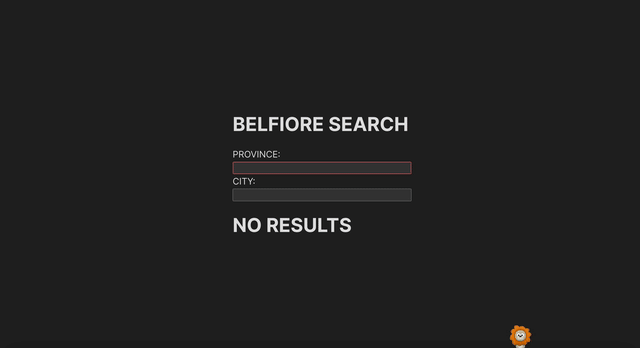

# Belfiore Search React/Redux

Minimal frontend to use my [belfiore-search API](https://github.com/giufus/belfiore-search).  



I created  the project using the following commands:  
```
npm create vite@latest <PROJECT NAME>
cd <PROJECT NAME>
npm install 
npm run dev
```

The goal of Redux is to provide scaleable and predictable state management, this is why I decided to use it here, even if the complexity of the project (3 components) doesn't require it.  

Let's install redux and react-redux using "The toolkit" (and axios as http client, just in case I decide to use it later):  
`npm install @reduxjs/toolkit react-redux axios` 

That's all.   

# React + TypeScript + Vite 

This template provides a minimal setup to get React working in Vite with HMR and some ESLint rules.

Currently, two official plugins are available:

- [@vitejs/plugin-react](https://github.com/vitejs/vite-plugin-react/blob/main/packages/plugin-react/README.md) uses [Babel](https://babeljs.io/) for Fast Refresh
- [@vitejs/plugin-react-swc](https://github.com/vitejs/vite-plugin-react-swc) uses [SWC](https://swc.rs/) for Fast Refresh

## Expanding the ESLint configuration

If you are developing a production application, we recommend updating the configuration to enable type aware lint rules:

- Configure the top-level `parserOptions` property like this:

```js
   parserOptions: {
    ecmaVersion: 'latest',
    sourceType: 'module',
    project: ['./tsconfig.json', './tsconfig.node.json'],
    tsconfigRootDir: __dirname,
   },
```

- Replace `plugin:@typescript-eslint/recommended` to `plugin:@typescript-eslint/recommended-type-checked` or `plugin:@typescript-eslint/strict-type-checked`
- Optionally add `plugin:@typescript-eslint/stylistic-type-checked`
- Install [eslint-plugin-react](https://github.com/jsx-eslint/eslint-plugin-react) and add `plugin:react/recommended` & `plugin:react/jsx-runtime` to the `extends` list
